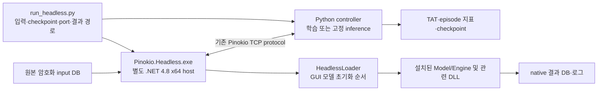

# Pinokio headless 디컴파일·분석·구현·검증 보고서

작성일: 2026-09-11
문서 및 재검증 버전: v10.6.4
구현 기준: v10.6.2 GUI 호환 수정이 적용된 headless host

## 1. 최종 결론

이 저장소의 headless 실행기는 Pinokio GUI나 시뮬레이션 엔진을 다시 구현한 프로그램이 아니다. 설치된 `Simulation.Model.dll`, `Simulation.Engine.dll` 및 관련 Pinokio DLL을 그대로 로드하고, GUI가 수행하던 모델 로드·초기화·TCP 연결·이벤트 실행·결과 저장 순서를 호출하는 **별도의 x64 .NET Framework 4.8 콘솔 host**다. 원본 `Pinokio.Simulator.exe`와 엔진 DLL은 수정하지 않았다.

초기 headless host에는 진입 assembly의 `TargetFrameworkAttribute`가 없었다. 이 누락 때문에 .NET Framework의 호환 정렬 동작이 GUI와 달라졌고, 경로 길이가 같은 유휴 OHT 후보의 `List.Sort` 순서가 바뀌었다. 최초 분기는 시뮬레이션 시각 `28.3994059321392`초의 `OHT_CHECK_OUT` 이벤트이며, 29초 wire 상태에서 GUI와 기존 headless가 OHT 53135와 53137의 목적지를 서로 바꾸어 선택했다.

host에 GUI와 같은 `.NETFramework,Version=v4.8` 대상 특성을 넣은 뒤 다음 범위에서 동등성을 확인했다.

- GUI capture와 수정 host의 0~119초 **120개 완전 frame**에서 비교 대상 bytes가 모두 일치했다. 공통 index는 0~120초 121개지만 마지막 120초 payload는 capture 종료 때 일부가 버퍼에 남아 완전 frame 비교에서 제외했다.
- 비교에서 제외한 값은 매 8,912-byte Python 비용 packet의 첫 4 bytes인 실제 wall-clock 시각뿐이다. 물리 상태, 비용, padding 등 다른 bytes는 제외하지 않았다.
- 같은 episode54 checkpoint와 입력의 2,000초 실행에서 GUI와 수정 headless의 TAT는 모두 167.7초였다.
- GUI의 마지막 완료 시각 `2026-02-16 07:32:59`를 cutoff로 삼으면 양쪽 `COMMAND_LOG` 8,921행의 43개 열이 모두 정확히 일치했다. 누락·추가 command와 값이 다른 command는 각각 0개다.
- headless는 종료 시 잔여 완료 command를 명시적으로 flush하므로 전체 DB에는 95행이 더 있다. 전체 9,016행의 평균 TAT는 `167.67754314551908`초이고 마지막 완료 시각은 `07:33:19`다. 공통 cutoff의 평균은 양쪽 모두 `167.71560721892166`초다.

이 결론은 기록된 input/checkpoint와 2,000초 Python batch 실행에 대한 것이다. 12시간 평가, 모든 입력 DB, native 난수 상태, C++ 내부 구현까지 포괄하는 일반적인 bit 단위 동일성 주장은 아니다.

## 2. 구성과 실행 흐름



`PythonCode/run_headless.py`가 실행별 runtime을 한 번 빌드하고 고정한 뒤 Python 서버와 native 프로세스를 관리한다. 에피소드마다 native 프로세스는 새로 시작하지만 같은 실행의 runtime 바이너리는 재사용한다. Python 학습 프로세스는 에피소드 사이에 유지된다. `PServer_Python`이라는 이름과 달리 native 쪽은 `TcpClient.Connect` 방식으로 Python listener에 접속한다.

GUI의 화면, form, shape, animation/playback은 만들지 않는다. 화면 콜백은 빈 handler로 연결한다. 실제 이산 이벤트 계산, OHT 이동, 경로 탐색과 dispatch는 설치된 DLL이 수행한다.

## 3. 사용 도구와 확인된 버전

| 목적 | 실제 도구 | 확인된 버전·경로 | 역할 |
| --- | --- | --- | --- |
| managed assembly 디컴파일 | ILSpy `ICSharpCode.Decompiler` API | 7.2.0.6844 (`ProductVersion 7.2.0.6844-104407a3`), `tools/pinokio/ilspy/ICSharpCode.Decompiler.dll` | 특정 type 조사 및 전체 module 엄격 디컴파일 |
| IL 검사·assembly 패치 | Mono.Cecil | 0.11.4.0, `tools/pinokio/ilspy/Mono.Cecil.dll` | private TCP 패치, transport IL 비교, framework attribute 검사 |
| C# 도구와 host 컴파일 | Microsoft .NET Framework x64 C# compiler | FileVersion 4.8.9232.0, `C:\Windows\Microsoft.NET\Framework64\v4.0.30319\csc.exe` | 도구와 `Pinokio.Headless.exe` 빌드 |
| wire/DB 비교 | 저장소 Python 환경 | `compare_wire.py`, `decode_oht.py`, `compare_final.py` | raw payload, OHT 상태, `COMMAND_LOG` 비교 |

`Framework64\v4.0.30319\csc.exe`는 compiler 도구 경로다. 이 문자열을 대상 framework가 4.0이라는 뜻으로 해석하면 안 된다. 실제 대상은 `HeadlessProgram.cs`의 assembly attribute와 빌드 후 `VerifyFramework.cs`가 검사하는 **.NET Framework 4.8**이다.

`tools/pinokio/build.ps1`은 ILSpy 7.2.0.6844 archive를 받을 때 SHA-256 `61341AEB5992BC76ECD09F29D4A39D13D96AFB4D3A498FC191FD999908EA667C`를 확인한다.

## 4. 1단계: 원본 식별과 증거 고정

비교에 사용한 핵심 identity는 `results/parity_fix/identities.json`에 보존되어 있다.

| 대상 | SHA-256 |
| --- | --- |
| `../Simulator/Pinokio.Simulator.exe` | `aa861ec9c55d4390002265f8808b11de2eeb5960d34a6b801b2544156631c53d` |
| `../Simulator/Simulation.Model.dll` | `0b6dfe9d7b1bbedff86edea73974f2f5c273468ecf944d760c63866954cf53ce` |
| `../Simulator/Simulation.Engine.dll` | `dce72570fdb7004bdd2faf150ec9bcce9c361b7c7b737f90619f8d062288f125` |
| `../db/base/AICC_Input_260403.db` | `dbe98bbf761a7f90ef924f0d552df9e2b1337a04837f9fc7f8771431bdad406d` |
| `results/episode54/checkpoint.pt` | `af984e9e3a3858d49fe5f512b2007b659acfc19c5baa8f7c229b9dba1276d7f3` |
| 수정 host `tools/pinokio/bin/Pinokio.Headless.exe` | `9569764e997d3cad555247cbeb4fc48af169b5eb50c5d9b3b10123746305c76a` |

이 hash는 당시 동등성 검증 대상의 identity다. 이후 빌드는 새 identity를 별도로 기록해야 한다.

## 5. 2단계: 디컴파일

### 5.1 초기 조사와 엄격 감사의 구분

`tools/pinokio/ilspy/Decompile.cs`는 ILSpy API로 지정 type 하나를 확인하는 조사 도구다. `ThrowOnAssemblyResolveErrors=false`이므로 전체 assembly의 성공 근거로 사용하지 않는다.

최종 검사는 `results/parity_fix/DecompileAudit.cs`를 사용했다. 이 도구는 `ThrowOnAssemblyResolveErrors=true`, `.NETFramework,Version=v4.8` resolver, CLR framework와 Simulator 참조 검색 경로, `DecompileWholeModuleAsString()`을 사용하며 예외 시 exit 1로 끝난다. 처음에는 `System.IO.Compression` 참조 해석에 실패했고 framework 참조 경로를 추가한 뒤 성공했다.

프로젝트 루트 PowerShell에서의 재현 명령:

```powershell
$csc = 'C:\Windows\Microsoft.NET\Framework64\v4.0.30319\csc.exe'
$ilspy = '.\tools\pinokio\ilspy'
$sim = (Resolve-Path '..\Simulator').Path
$auditOutput = '.\results\parity_recheck\manual_decompile'
New-Item -ItemType Directory -Path $auditOutput -ErrorAction Stop | Out-Null

& $csc /nologo ("/out:$ilspy\DecompileAudit.exe") `
  /r:C:\Windows\Microsoft.NET\Framework64\v4.0.30319\netstandard.dll `
  ("/r:$ilspy\System.Reflection.Metadata.dll") `
  ("/r:$ilspy\ICSharpCode.Decompiler.dll") `
  '.\results\parity_fix\DecompileAudit.cs'
if ($LASTEXITCODE -ne 0) { throw 'Decompiler build failed' }

& "$ilspy\DecompileAudit.exe" "$sim\Simulation.Model.dll" `
  "$auditOutput\Simulation.Model.full.cs" $sim
if ($LASTEXITCODE -ne 0) { throw 'Model decompilation failed' }
& "$ilspy\DecompileAudit.exe" "$sim\Simulation.Engine.dll" `
  "$auditOutput\Simulation.Engine.full.cs" $sim
if ($LASTEXITCODE -ne 0) { throw 'Engine decompilation failed' }
& "$ilspy\DecompileAudit.exe" "$sim\Pinokio.Simulator.exe" `
  "$auditOutput\Pinokio.Simulator.full.cs" $sim
if ($LASTEXITCODE -ne 0) { throw 'GUI decompilation failed' }
& "$ilspy\DecompileAudit.exe" '.\tools\pinokio\bin\Pinokio.TCP.IP.dll' `
  "$auditOutput\PatchedTCP.full.cs" $sim
if ($LASTEXITCODE -ne 0) { throw 'Transport decompilation failed' }
```

| 보존 결과 | 크기 | 줄 수 |
| --- | ---: | ---: |
| `Simulation.Model.full.cs` | 2,448,179 bytes | 68,295 |
| `Simulation.Engine.full.cs` | 69,380 bytes | 3,549 |
| `Pinokio.Simulator.full.cs` | 3,033,330 bytes | 67,471 |
| `PatchedTCP.full.cs` | 120,106 bytes | 3,322 |

파일은 모두 `results/parity_fix/`에 있다. 네 결과에서 디컴파일 실패나 미지원 코드를 나타내는 표식을 발견하지 않았다. `DispatchCpp.dll`과 `Shortestpath.dll`은 native C++ binary이므로 이 범위에 포함되지 않는다.

## 6. 3단계: GUI 흐름과 엔진 동작 분석

| GUI 작업 | headless 구현 | 주 근거 |
| --- | --- | --- |
| input 열기·복호화 | 암호화 여부 확인 후 작업 폴더의 `input.db`로 복호화 | `HeadlessProgram.cs` |
| model 구성 | `DownloadSimModels` → `SetSimulationModelTotalModel` → GUI 초기화 순서 | `HeadlessLoader.cs`, `Pinokio.Simulator.full.cs` |
| network·경로 초기화 | rail/network, zone, Dijkstra, commander, A* 자료구조와 주기 node 생성 | `HeadlessLoader.cs` |
| Python 연결 | `StartServer`, ready event, `ReLoadNewModel`, frame/new-model message | `HeadlessProgram.cs`, `run_headless.py` |
| simulation 실행 | 비용·route·bumping 갱신, `ReadyEngine`, `RunEngine`, 종료 node, `RunEvent` loop | `HeadlessProgram.cs`, `Simulation.Engine.full.cs` |
| 결과 저장 | native result API, 완료 command/평균 table flush, end-of-frame | `HeadlessProgram.cs` |

`HeadlessLoader`는 GUI method 자체를 실행하는 것이 아니라 디컴파일로 확인한 구성 순서를 별도 코드로 옮겼다. event 처리, 이동, routing, dispatch 계산은 원본 DLL method를 직접 호출한다.

기본 경로 알고리즘은 **Dijkstra**다. `PathFinder.FindPath()`는 `IsUseAstar`가 참인 특정 조건에서만 A*를 호출하며 기본 host에서는 이 flag가 false다. `InitAstar`가 자료구조를 만든다는 사실은 기본 알고리즘이 A*라는 뜻이 아니다. 최초 분기가 난 `GetFastsOHTNPath()`도 Dijkstra 경로 길이를 사용한다.

`IsUseAccelearionVer=true`는 **C++ dispatch 가속 경로 선택 flag**이며 OHT 물리 가속도 설정이 아니다. `DispatchCpp.dll`, `Shortestpath.dll`의 원본 C++ 소스는 확보되지 않았고 Linux/GPU 이식도 완료되지 않았다. 이산 이벤트 계산은 Windows CPU에서 수행하며 Python RL만 CUDA를 사용할 수 있다.

## 7. 4단계: 최초 차이 격리와 원인 규명

같은 input, episode54/step108050 checkpoint, CUDA 무노이즈 inference에서 GUI와 수정 전 host를 비교했다.

1. 0~28초 rail/job/OHT 수신 payload와 Python 비용 응답은 일치했다.
2. headless 이벤트 계측에서 `28.3994059321392`초 `RailLineNode/A1_Line_5196_5145/OHT_CHECK_OUT`의 유휴 차량 Bay 재배치가 최초 목적지 변경 지점으로 확인됐다.
3. 29초에 GUI는 OHT 53137을 목적 rail 2516으로, 기존 headless는 OHT 53135를 보냈다. 다른 차량은 rail 2497을 유지했다. rail ID는 Python wire mapping 기준이다.
4. rail/OHT packet과 비용 응답은 29초, job packet은 63초에 처음 달랐다.

`decode_oht.py`는 capture를 production `PClient.RecieveOHTData()`로 해석한다. `oht_differences.json`에는 28초의 상태가 같고 29초의 `DestinationLine`, `RouteList`, `RemainingDistanace`가 서로 바뀐 사실이 남아 있다.

원인은 headless 진입 EXE의 `TargetFrameworkAttribute` 누락이었다. 원본 GUI에는 `.NETFramework,Version=v4.8`이 있다. 진입 assembly target은 framework의 binary compatibility 분기를 선택하며, 동점 비교가 0을 반환하는 `List.Sort`에서 구버전 QuickSort와 4.8 Introsort가 후보 순서를 달리 만들었다. `SortCompatibility.cs`의 최소 재현은 target 없음에서 `53137,53135`, 4.8 target에서 `53135,53137`을 출력한다. 이는 정렬 의미의 최소 재현이며 실제 native 후보 배열 전체 dump는 아니다.

외부 근거: Microsoft [.NET Framework 호환성 설명](https://devblogs.microsoft.com/dotnet/introduction-to-net-framework-compatibility/), [ArraySortHelper reference source](https://github.com/microsoft/referencesource/blob/main/mscorlib/system/collections/generic/arraysorthelper.cs).

## 8. 5단계: 구현

### 8.1 GUI 호환 host

`HeadlessProgram.cs`에 GUI와 같은 target attribute를 추가하고, 시작 시 `AppDomain.CurrentDomain.SetupInformation.TargetFrameworkName`이 정확히 `.NETFramework,Version=v4.8`인지 검사한다. `VerifyFramework.cs`는 Mono.Cecil로 원본 GUI와 새 host의 metadata를 비교한다. config의 `supportedRuntime ... sku=v4.8`만 복사하는 것으로는 이 동작을 선택할 수 없다.

### 8.2 private TCP transport

원본 transport는 연결 client 감시 loop를 대기 없이 반복한다. `PatchTransport.cs`는 원본을 수정하지 않고 실행별 private 복사본의 `PServer_Python.StartingServerLocal` loop에만 `Thread.Sleep(5)`를 넣는다. simulation tick이나 action마다 5 ms를 더하지 않는다.

패치는 원본 SHA-256이 `dd470f9c42dda3d9ea4838d665d86dc64e6a5e2b8084f4e4030a17761cfc8da3`일 때만 허용된다. `AuditTransport.cs`는 원본과 private DLL의 131개 method body를 비교하고 branch target을 instruction index로 정규화한다. 기록된 결과는 `Compared methods=131 changed=1`이며 변경 method는 `StartingServerLocal` 하나다.

```powershell
$csc = 'C:\Windows\Microsoft.NET\Framework64\v4.0.30319\csc.exe'
$cecil = '.\tools\pinokio\ilspy\Mono.Cecil.dll'
& $csc /nologo '/out:.\tools\pinokio\ilspy\AuditTransport.exe' `
  ("/r:$cecil") '.\results\parity_fix\AuditTransport.cs'
& '.\tools\pinokio\ilspy\AuditTransport.exe' `
  '..\Simulator\Pinokio.TCP.IP.dll' '.\tools\pinokio\bin\Pinokio.TCP.IP.dll'
```

### 8.3 빌드와 episode 관리

```powershell
& '.\tools\pinokio\build.ps1'
```

`build.ps1`은 private transport 생성, 설치 DLL을 참조한 x64 host 컴파일, GUI/headless target 비교, GUI config 복사와 `loadFromRemoteSources` 추가를 수행한다.

`run_headless.py`는 port·경로를 검사하고 checkpoint를 실행 폴더로 복사해 hash를 남기며 runtime을 한 번 준비한다. 각 native episode는 별도 프로세스와 작업 DB를 사용한다. 종료 후 log marker, result DB, SQLite `PRAGMA quick_check`를 검사한다. 옵션만 확인하려면 다음처럼 `--check`를 쓴다.

```powershell
& '.\.venv\Scripts\python.exe' '.\PythonCode\run_headless.py' `
  --mode inference --checkpoint '.\results\episode54\checkpoint.pt' `
  --episodes 1 --end-time 2000 --port 9101 `
  --output-dir '.\results\headless_check' --name 'episode54_fixed' `
  --device cuda --no-wandb --check
```

## 9. 6단계: 동등성 검증

### 9.1 raw wire

`compare_wire.py`는 `RecieveRailLineData`, `RecieveJobData`, `RecieveOHTData`, `SendRailLineCostMessage` 네 phase가 모두 있어야 완전 frame으로 인정한다.

```powershell
& '.\.venv\Scripts\python.exe' '.\results\parity_fix\compare_wire.py' `
  '.\results\parity_fix\gui_wire\run_0911_1649_v10.6.2_b_rl_0.0-1.0_Q_guiwire' `
  '.\results\parity_fix\wire_runs\run_0911_1648_v10.6.2_b_rl_0.0-1.0_Q_headless' `
  '.\results\parity_recheck\manual_wire_before.json'

& '.\.venv\Scripts\python.exe' '.\results\parity_fix\compare_wire.py' `
  '.\results\parity_fix\gui_wire\run_0911_1649_v10.6.2_b_rl_0.0-1.0_Q_guiwire' `
  '.\results\parity_fix\framework_runs\run_0911_1701_v10.6.2_b_rl_0.0-1.0_Q_headless' `
  '.\results\parity_recheck\manual_wire_fixed.json'
```

| 비교 | 결과 |
| --- | --- |
| GUI vs 수정 전 | 0~28초 29 frame 일치; rail/OHT/cost 첫 차이 29초, job 첫 차이 63초 |
| GUI vs 4.8 수정 후 | 공통 index 121개; 0~119초 120개 완전 frame 모두 일치; 차이 0개; 120초 payload 불완전 |

OHT payload 해석 명령:

```powershell
& '.\.venv\Scripts\python.exe' '.\results\parity_fix\decode_oht.py' `
  '.\results\parity_fix\gui_wire\run_0911_1649_v10.6.2_b_rl_0.0-1.0_Q_guiwire' `
  '.\results\parity_fix\wire_runs\run_0911_1648_v10.6.2_b_rl_0.0-1.0_Q_headless'
```

### 9.2 2,000초 결과 DB

```powershell
& '.\.venv\Scripts\python.exe' '.\results\parity_fix\compare_final.py' `
  '.\results\episode54\gui_first.db' `
  '.\results\parity_fix\production_fixed\run_0911_1703_v10.6.2_b_rl_0.0-1.0_Q_headless\framework_fixed.db' `
  '.\results\parity_recheck\manual_db_comparison.json'
```

`compare_final.py`는 DB를 read-only로 열어 `PRAGMA quick_check`를 확인하고 `COMMAND_LOG.NAME` 유일성을 검사한다. 두 DB의 이른 마지막 완료 시각을 cutoff로 정하고 이름별 모든 column을 비교한다.

| 항목 | GUI | 수정 headless |
| --- | ---: | ---: |
| 표시 TAT | 167.7초 | 167.7초 |
| cutoff까지 command | 8,921 | 8,921 |
| cutoff 평균 TAT | 167.71560721892166초 | 167.71560721892166초 |
| cutoff rerouting 합 | 5,099 | 5,099 |
| 공통 command 중 변경 | 0 | 0 |
| flush 포함 전체 command | 8,921 | 9,016 |
| 전체 평균 TAT | 167.71560721892166초 | 167.67754314551908초 |

수정 production host는 497.34초 wall time에 완주했다. DB 파일 hash 자체가 서로 같은지는 동등성 조건이 아니다. 검증 결론은 공통 cutoff의 8,921개 command와 43개 열 값이 모두 같다는 것이다.

## 10. v10.6.4 독립 재검증

v10.6.4에서는 원본 증거를 덮어쓰지 않고 `results/parity_recheck`에 새 결과를 저장했다. **새 2,000초 simulation을 실행한 검증은 아니다.** 저장된 2,000초 GUI/fixed DB와 wire를 다시 계산하고, 별도로 현재 production host의 120초 inference를 새로 실행했다.

| 재검증 | 결과 |
| --- | --- |
| fresh build GUI/headless target metadata | `.NETFramework,Version=v4.8` 일치, PASS |
| targetless negative check | 예상대로 거절(exit 1), PASS |
| private transport | 131 methods 비교, 알려진 `StartingServerLocal` 1개만 변경, PASS |
| Python headless tests | 13 tests, 0.101초, PASS |
| strict 전체 디컴파일 | 4 managed modules 모두 exit 0, 진단 marker 없음, 이전 strict 출력과 각각 동일, PASS |
| 저장된 2,000초 DB 재대조 | 원본 hash 불변, schema 43열 일치, cutoff 8,921행 전 열 일치, PASS |
| 저장 wire 재대조 | GUI와 기존 수정 host의 0~119초 120 complete frames 일치, PASS |
| 새 120초 production host | TAT 74.4초, wall time 32.15초, full horizon, 조기 종료/학습 실패 없음, PASS |
| 새 wire vs GUI | 0~119초 120 complete frames 일치, GUI의 120초 마지막 cost payload 잘림 1건만 제외, PASS |
| 새 wire vs 기존 수정 host | 0~120초 121 complete frames 전부 일치, buffered frame 없음, PASS |

새 strict 출력은 `results/parity_recheck/decompiled`에 있다. `revalidation.json`에는 각 출력 SHA-256과 이전 strict 출력 일치 여부를 기록했다. wire index의 각 phase payload는 저장된 SHA-256으로 확인했고, GUI capture의 마지막 잘린 payload를 제외하면 prior/fresh capture의 index 무결성 검사를 통과했다.

새 wire 실행에 사용한 명령:

```powershell
& '.\.venv\Scripts\python.exe' '.\results\parity_recheck\run_wire.py' `
  --mode inference --input '..\db\base\AICC_Input_260403.db' `
  --checkpoint '.\results\episode54\checkpoint.pt' `
  --port 9101 --end-time 120 --episodes 1 --name recheck `
  --output-dir '.\results\parity_recheck\rollouts' --no-wandb
```

전체 evidence를 다시 계산하는 명령은 다음과 같다.

```powershell
& '.\.venv\Scripts\python.exe' '.\results\parity_recheck\verify_evidence.py' `
  --rollout '.\results\parity_recheck\rollouts\run_0911_1825_v10.6.4_b_rl_0.0-1.0_Q_headless'
```

기계 판독 최종 결과는 `results/parity_recheck/revalidation.json`이다. 요약과 세부 근거는 `evidence_summary.json`, `db_comparison.json`, `fresh_gui_wire_comparison.json`, `fresh_prior_wire_comparison.json`, `wire_index_integrity.json`, `tool_versions.json`에 나누어 보존했다.

핵심 재검증 결과를 빠르게 확인하려면 [최종 재검증 기록](HEADLESS_REVALIDATION.md)을 읽는다.
재현 명령은 현재 workspace에 보존된 도구·입력·checkpoint·capture를 전제로 한다.
대용량 실행 산출물과 원본 상용 바이너리는 Git에 포함시키지 않았다.

## 11. 현재 운영 상태와 제한

- v10.6.3의 새 50-episode Stage 1 재학습은 GUI 호환 runtime, TCP handshake, simulation 진행, fresh warmup/replay 및 finalizer 대기를 확인하고 시작했다. **학습 완료나 최종 성능은 확인되지 않았다.**
- 수정 전에 시작된 실행은 4.8 수정 결과로 소급 해석하지 않는다. run의 runtime hash와 버전으로 구분한다.
- 원본 GUI/엔진 DLL, routing 비용, reward, policy weight, 동점 비교 함수는 수정하지 않았다. 변경은 별도 host target과 private transport 감시 loop다.
- GUI가 별도로 읽는 speed Excel, AI2.0 사용자 parameter, 시간대별 설정은 자동으로 가져오지 않는다. 다른 GUI 상태를 비교할 때 별도로 고정해야 한다.
- 2,000초 일치는 45,000초/12시간 run, 모든 checkpoint·input, 모든 native 난수 경로의 동일성을 자동 보장하지 않는다.
- C++ `Shortestpath.dll`과 `DispatchCpp.dll` 원본 소스는 확보하지 못했다. managed P/Invoke 경계와 flag는 확인했지만 내부 전체를 소스 수준으로 검증하거나 Linux/GPU로 이식하지 않았다.

## 12. 핵심 근거 파일

| 구분 | 경로 |
| --- | --- |
| 구현 | `tools/pinokio/HeadlessProgram.cs`, `HeadlessLoader.cs`, `PatchTransport.cs`, `VerifyFramework.cs`, `build.ps1` |
| 실행 관리 | `PythonCode/run_headless.py` |
| 디컴파일 | `tools/pinokio/ilspy/Decompile.cs`, `results/parity_fix/DecompileAudit.cs`, `*.full.cs` |
| transport 감사 | `results/parity_fix/AuditTransport.cs` |
| wire 비교 | `results/parity_fix/compare_wire.py`, `wire_comparison.json`, `framework_comparison.json` |
| OHT 해석 | `results/parity_fix/decode_oht.py`, `oht_differences.json`, `SortCompatibility.cs` |
| 최종 DB 비교 | `results/parity_fix/compare_final.py`, `final_comparison.json` |
| identity | `results/parity_fix/identities.json` |
| 수정 요약 | `HEADLESS_PARITY_FIX.md` |
| v10.6.4 재검증 | `results/parity_recheck/revalidation.json`, `evidence_summary.json`, `verify_evidence.py` 및 세부 JSON |
